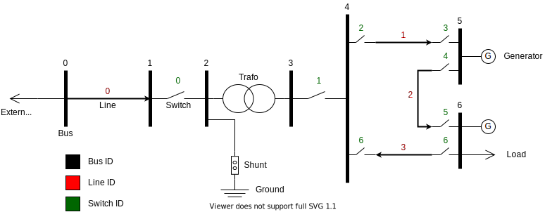

# power-grid-simulator

This repository contains a digital twin of a power grid. It starts an
environment where pyhsical simulations of the grid are performed. Different
communication interfaces can be configured with the simulator, that host their
servers and allow external applications to connect. Currently supported types
of communication interfaces set up servers using Modbus and IEC104 industrial
protocols.

The simulator is a Python project, where an executable is ran with a
configuration that specifies communication interfaces and the values they serve
on their servers. External applications can then connect to those interfaces
and display the readings from the devices.

## Setup

To run the project, clone this repository and install the requirements (use of
virtual environments is encouraged) by calling:

```shell
pip install -r requirements.txt
```

## Running

The simulator may be ran by positioning to the root of this repository and
calling:

```shell
python -m simulator.main
```

This will run the simulator with the default configuration. Alternatively, to
use a different configuration, `--conf-path` argument may be passed, whose
value is a path to a JSON or YAML file containing a different configuration.
More on configuring the simulator in the following sections.

## Simulation

The simulator uses a [simple power
grid](https://pandapower.readthedocs.io/en/v2.4.0/networks/example.html#simple-example-network).
This grid has a connection to an external grid, two generators and a load. The
generators and loads sporadically change their power generations and
consumptions, causing changes of physical properties of elements across the
whole network. The communication interfaces wait for these changes and, when
they occur, they notify them over the industrial protocols that they use.
Additionally, the communication interfaces may also affect the simulation, by
changing some of its parameters based on the messages they receive from their
clients.

## Default configuration

The default configuration starts a simulation with the following power grid:



A communication interface using an IEC104 slave is set up to listen for new
connections on address `127.0.0.1:12345`. It may be interrogated in order to
receive the whole state and it will notify all active connections if simulation
changes occur. IEC104 clients can send command requests in order to modify the
states of the switch elements, causing the simulation to turn them off or on.

The following table shows how individual measurements and indications (switch
positions) are converted into IEC104 data (ASDU, IO and used type):

|Element type|Element ID|Property                      |ASDU|IO  |IEC 104 type |
|------------|----------|------------------------------|----|----|-------------|
|Bus         |0         |active power                  |0   |0   |FloatingValue|
|Bus         |0         |inactive power                |0   |1   |FloatingValue|
|Bus         |1         |active power                  |1   |0   |FloatingValue|
|Bus         |1         |inactive power                |1   |1   |FloatingValue|
|Bus         |2         |active power                  |2   |0   |FloatingValue|
|Bus         |2         |inactive power                |2   |1   |FloatingValue|
|Bus         |3         |active power                  |3   |0   |FloatingValue|
|Bus         |3         |inactive power                |3   |1   |FloatingValue|
|Bus         |4         |active power                  |4   |0   |FloatingValue|
|Bus         |4         |inactive power                |4   |1   |FloatingValue|
|Bus         |5         |active power                  |5   |0   |FloatingValue|
|Bus         |5         |inactive power                |5   |1   |FloatingValue|
|Bus         |6         |active power                  |6   |0   |FloatingValue|
|Bus         |6         |inactive power                |6   |1   |FloatingValue|
|Line        |0         |active power from             |10  |0   |FloatingValue|
|Line        |0         |inactive power from           |10  |1   |FloatingValue|
|Line        |0         |active power to               |10  |2   |FloatingValue|
|Line        |0         |inactive power to             |10  |3   |FloatingValue|
|Line        |0         |overload percent              |10  |4   |FloatingValue|
|Line        |1         |active power from             |11  |0   |FloatingValue|
|Line        |1         |inactive power from           |11  |1   |FloatingValue|
|Line        |1         |active power to               |11  |2   |FloatingValue|
|Line        |1         |inactive power to             |11  |3   |FloatingValue|
|Line        |1         |overload percent              |11  |4   |FloatingValue|
|Line        |2         |active power from             |12  |0   |FloatingValue|
|Line        |2         |inactive power from           |12  |1   |FloatingValue|
|Line        |2         |active power to               |12  |2   |FloatingValue|
|Line        |2         |inactive power to             |12  |3   |FloatingValue|
|Line        |2         |overload percent              |12  |4   |FloatingValue|
|Line        |3         |active power from             |13  |0   |FloatingValue|
|Line        |3         |inactive power from           |13  |1   |FloatingValue|
|Line        |3         |active power to               |13  |2   |FloatingValue|
|Line        |3         |inactive power to             |13  |3   |FloatingValue|
|Line        |3         |overload percent              |13  |4   |FloatingValue|
|Transformer |0         |active power on high voltage  |20  |0   |FloatingValue|
|Transformer |0         |inactive power on high voltage|20  |1   |FloatingValue|
|Transformer |0         |active power on low voltage   |20  |2   |FloatingValue|
|Transformer |0         |inactive power on low voltage |20  |3   |FloatingValue|
|Transformer |0         |loading percent               |20  |4   |FloatingValue|
|Switch      |0         |closed                        |30  |0   |SingleValue  |
|Switch      |1         |closed                        |30  |1   |SingleValue  |
|Switch      |2         |closed                        |30  |2   |SingleValue  |
|Switch      |3         |closed                        |30  |3   |SingleValue  |
|Switch      |4         |closed                        |30  |4   |SingleValue  |
|Switch      |5         |closed                        |30  |5   |SingleValue  |
|Switch      |6         |closed                        |30  |6   |SingleValue  |
|Switch      |7         |closed                        |30  |7   |SingleValue  |

## Configuration

Users of the simulator may also specify their own configuration, changing the
way communication interfaces interact with the simulator. Configuration is a
JSON/YAML file with properties `communication` and `process`. The first
configurs the communication interfaces, while the second configures the
physical simulation.

`communication` property is an array whose items are objects with properties
`name` and `type`. The type differentiates between the different protocols
supported by the system (currently, `modbus` and `iec104` are supported).  The
name differentiates the individual instances of the communication interfaces
(e.g. perhaps we want to have several `modbus` servers).  Additionally, a
communication entry can also have protocol-specific properties like the
listening address, various timeouts, etc. Currently, both Modbus and IEC104
interfaces only have the property `address`, where one may write a URL that
specifies the listening address of the interface (hostname and port are taken
into consideration).

`process` property configures the simulation and the way communication
interfaces connect to it. It has two subproperties, `spontaneity` and `points`.
Spontaneity configures how often the random changes occur. The points property
as an array whose items configure individual connections between the simulation
and the communication interfaces. Every point has properties `table`,
`property` and `id`, which correspond to the properties of the [pandapower
network](https://pandapower.readthedocs.io/en/v2.4.0/elements.html), which is a
data structure the simulation uses to calculate its state, introduce changes,
etc. Additionally, every point has an `outputs` array, whose items specify how
certain communication interfaces present the value of the point to their
clients. These outputs items have a property `name`, which is paired with the
names in the `communication` section, and other properties that are
protocol-specific. When a change in the simulation that affects that point
occurs, the communication interface is notified and it passes that information
along to any external application that may be connected to it. For instance, if
we configure the following point:

```yaml
communication:
  - name: inteface1
    type: iec104
    address: 'tcp+iec104://127.0.0.1:12345'
  ...
points:
  ...
  - table: res_bus
    id: 0
    property: p_mw
    type: float
    outputs:
      - name: interface1
        asdu: 10
        io: 12
  ...
...
```

This point watches for changes on bus 0 (`table` and `id` properties), of the
property representing their active power (`p_mw`). When active power changes,
that change will be notified over `interface1`, which uses the IEC104 protocol,
and it will be identified with ASDU address 10 and IO address
12. Following this, IEC104 outputs have properties `asdu` and `io`, which
determine the identifier of the data.

Modbus outputs only have the property `address`, which sets up the memory
address at which the data is served.  In that case, different data types also
take different quantities:

  * single types are mapped to a integer where False is 0 and True is 1, their
    quantity is 1
  * float types are encoded using the [IEEE 754
    standard](https://en.wikipedia.org/wiki/Single-precision_floating-point_format).
    They are encoded using 32 bits, so the quantity when querying modbus for
    this type of data should be 4.
