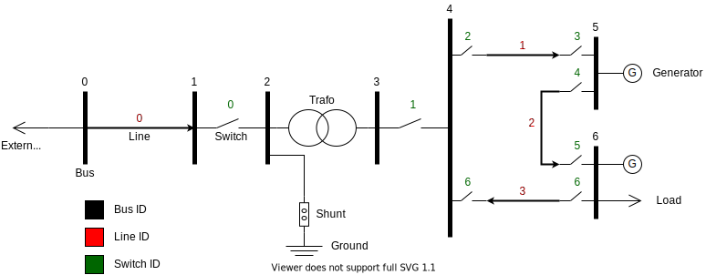

# Network

Sustav prima podatke iz simulatora (vanjska jedinica). 
Sustav omogucava prikaz i upravljanje prikazanim podatcima.

Detaljnije upute preporučenih koraka razvoja sustava se nalaze
[ovdje](development_steps.md). Repozitorij koda s potrebnom pozadinskom
infrastrukturom (*quickstart*) od se nalazi
[ovdje](https://github.com/ket-praksa/hat-quickstart).
[Ovdje](https://github.com/ket-praksa/assignment) se nalazi simulator
energetskog podsustava koji generira vrijednosti  i šalje ih pomoću *IEC
60870-5-104* protokola prema sustavu.

# *IEC 60870-5-104* protokol

*IEC 104* je industrijski komunikacijski protokol koji se koristi u energetici
za komunikaciju s terenskim uređajima.  Jedan je od raznim protokola koji se
koriste za tu svrhu.   Vaš zadatak je da iskoristite implementaciju IEC 104
drivera iz  Hat-core repozitorija da bi ostvarili komunikaciju sa simulatorom.
Primjer korištenja drivera se nalazi na donjim linkovima.

[IEC 60870-5-104 Hat-core implementacija.](https://core.hat-open.com/docs/libraries/drivers/iec104.html)  
[IEC 60870-5-104 Hat-core dokumentacija.](https://core.hat-open.com/docs/pyhat/hat/drivers/iec104/index.html)

pokreće se simulator koji obavlja fizikalnu simulaciju električne mreže i
podiže IEC 104 slave kroz koji šalje podatke o stanjima raznih elemenata u
mreži. Simulator implementira mrežu sa slike:

## Elementi

Simulator poslužuje 4 vrste elemenata i u nastavku su kratki opisi svakog od
njih.

### Sabirnica (bus)

Sabirnice služe kao konekcijske točke za različite druge elemente poput
priključaka na potrošače, vodove, generatore i sl. Podatci za sabirnice su
servirani na adresama gdje je ASDU broj 0-9 i odgovara identifikatoru
sabirnice. IO adresama određeno je o kojem svojstvu sabirnice se radi:

|IO|Svojstvo           |
|--|-------------------|
|0 |Aktivna snaga [MW] |
|1 |Jalova snaga [MVar]|

### Vod (line)

Električni vodovi povezuju elemente električne mreže na veće udaljenosti.
Njihovi podatci su servirani na adresama gdje je asdu broj 10-19, a desna
znamenka odgovara identifikatoru voda. Početak i kraj su određeni strelicama.
IO adresama određeno je o kojem svojstvu voda se radi:

|IO|Svojstvo                           |
|--|-----------------------------------|
|0 |Aktivna snaga na početku voda [MW] |
|1 |Jalova snaga na početku voda [MVar]|
|2 |Aktivna snaga na kraju voda [MW]   |
|3 |Jalova snaga na kraju voda [MVar]  |
|4 |Opterećenje [%]                    |

### Transformator (transformer)

Konektor dva elementa u mreži koji obavlja konverziju potencijala. Dakle na
jednoj strani konektora radi s jednom naponskom razinom, na drugoj s drugom. U
mreži je samo jedan transformator i njegov ASDU je 20. IO adrese ovise o
svojstvima:

|IO|Svojstvo                                      |
|--|----------------------------------------------|
|0 |Aktivna snaga na strani s višim naponom [MW]  |
|1 |Jalova snaga na strani s višim naponom [MVar] |
|2 |Aktivna snaga na strani s nižim naponom [MW]  |
|3 |Jalova snaga na strani s nižim naponom [MVar] |
|4 |Opterećenje [%]                               |

### Prekidač (switch)

Konektor koji može biti u otvorenom ili zatvorenom stanju i ovisno o tome
provodi struju. Podatci o prekidačima servirani su na ASDU 30-39, desna
znamenka je identifikator prekidača. Jedino svojstvo prekidača (IO=0) je
njegovo stanje otklopljenosti. Ono je predstavljeno IEC 104 tipom Single, koji
može imati vrijednosti ON i OFF, gdje ON znači zaklopljeno, a OFF otklopljeno.
Također je moguće simulatoru slati komande na te ASDU/IO adrese i mijenjati
stanje prekidača.

## Implementacija simulatora

Dodatni detalji oko implementacije simulatora navedeni su u ovom dijelu. Za
potrebe rješavanja nekog najosnovnijeg dijela zadatka nije potrebno ulaziti u
detalje oko te implementacije, no ako postoji potreba za promjenom nekog dijela
simulatora, ovdje je opisana njegova fizikalna simulacija.

Simulator implementira [jednostavnu
mrežu](https://pandapower.readthedocs.io/en/v2.6.0/networks/example.html#pandapower.networks.example_simple)
iz dokumentacije alata *pandapower*.  Detaljniji opis mreže se nalazi
[ovdje](https://github.com/e2nIEE/pandapower/blob/master/tutorials/create_simple.ipynb).
Simulator predstavlja digitalnog dvojnika neke jednostavne mreže i simulira
pripadne podatke.

[*Pandapower*](https://www.pandapower.org/) je biblioteka koja služi za
simulaciju, analizu i optimizaciju energetskih sustava.

Ova mreža se sastoji od sljedećih parametara:

- *bus* (7 elemenata)
- *load* (2 elemenata)
- *sgen* (1 element)
- *gen* (1 element)
- *switch* (8 elemenata)
- *shunt* (1 element)
- *ext_grid* (1 element)
- *line* (4 elemenata)
- *trafo* (1 element)

U nastavku se nalaze podaci o tim elementima:

### *Bus*

|   |name              |vn_kv   |type   |zone   |in_service   |
|---|------------------|--------|-------|-------|-------------|
|  0|HV Busbar         |110.0   |b      |-      |True         |
|  1|HV Busbar 2       |110.0   |b      |-      |True         |
|  2|HV Transformer Bus|110.0   |n      |-      |True         |
|  3|MV Transformer Bus|20.0    |n      |-      |True         |
|  4| MV Main Bus      |20.0    |b      |-      |True         |
|  5| MV Bus 1         |20.0    |b      |-      |True         |
|  6| MV Bus 2         |20.0    |b      |-      |True         |

### *Load*

|   |name              |bus   |p_mw   |q_mvar   |const_z_percent_   |const_i_percent   |sn_mva| scaling| in_service| type |
|---|------------------|------|-------|---------|-------------------|------------------|------|--------|-----------|------|
|0  |load              |6     |2.0    |4.0      |0.0                |0.0               |-     |0.6     |True       |wye   |
|1  |zip_load          |6     |2.0    |4.0      |30.0               |20.0              |-     |1.0     |True       |wye   |

### *Sgen*

|   |name              |bus   |p_mw   |q_mvar   |sn_mwa   | scaling| in_service| type |current_source|
|---|------------------|------|-------|---------|---------|--------|-----------|------|--------------|
|0  |static_power      |6     |2.0    |-0.5      |-       |1.0     |True       |wye   |True          |

### *Gen*

|   |name              |bus   |p_mw   |vm_pu    |sn_mwa   | min_q_mvar|max_q_mvar |scaling  |slack  |in_service      |type|
|---|------------------|------|-------|---------|---------|-----------|-----------|---------|-------|----------------|----|
|0  |generator         |5     |6.0    |1.03      |-       |-3.0       |3.0        |1.0      |False  |True            |-   |

### *Switch*

|   |bus   |element   |et    |type   |closed  |name   |z_ohm  |
|---|------|----------|------|-------|--------|-------|-------|
|0  |1     |2         |b     |CB     |True    |-      |0.0    |
|1  |3     |4         |b     |CB     |True    |-      |0.0    |
|2  |4     |1         |l     |LBS    |True    |-      |0.0    |
|3  |5     |1         |l     |LBS    |True    |-      |0.0    |
|4  |5     |2         |l     |LBS    |True    |-      |0.0    |
|5  |6     |2         |l     |LBS    |False   |-      |0.0    |
|6  |6     |3         |l     |LBS    |True    |-      |0.0    |
|7  |4     |3         |l     |LBS    |True    |-      |0.0    |

### *Shunt*

|   |bus    |name   |q_mvar   |p_mw   |vn_kv   |step   |max_step   |in_service|
|---|-------|-------|---------|-------|--------|-------|-----------|----------|
|0  |2      |Shunt  |-0.96    |0.0    |11.0    |1.0    |1          |True      |

### *Ext_grid*

|   |name   |bus   |vm_pu   |va_degree   |in_service|
|---|-------|------|--------|------------|----------|
|0  |-      |0     |1.02    |50.0        |True      |

### *Line*

|   |name       |std_type                          |from_bus    |to_bus     |length_km   |r_ohm_per_km      |x_ohm_per_km     |c_nf_per_km     |g_us_per_km     |max_i_ka   |df     |parallel   |type     |in_service|
|---|-----------|----------------------------------|------------|-----------|------------|------------------|-----------------|----------------|----------------|-----------|-------|-----------|---------|----------|
|0  |Line1      |N2XS(FL)2Y 1x300 RM/35 64/110 kV  |0           |1          |10.0        |0.0600            |0.144            |144.0           |0.0             |0.588      |1.0    |1          |cs       |True      |
|1  |Line2      |NA2XS2Y 1x240 RM/25 12/20 kV      |4           |5          |2.0         |0.1220            |0.112            |304.0           |0.0             |0.421      |1.0    |1          |cs       |True      |
|2  |Line3      |48-AL1/8-ST1A 20.0                |5           |6          |3.5         |0.5939            |0.372            |9.5             |0.0             |0.210      |1.0    |1          |ol       |True      |
|3  |Line4      |NA2XS2Y 1x240 RM/25 12/20 kV      |6           |4          |2.5         |0.1220            |0.112            |304.0           |0.0             |0.421      |1.0    |1          |cs       |True      |

### *Trafo*

|   |name        |bus   |p_mw    |vm_pu       |sn_mva    |min_q_mvar     |max_q_mvar    |scaling    |slack     |in_service    |type    |
|---|------------|------|--------|------------|----------|---------------|--------------|-----------|----------|--------------|--------|
0   |generator   |5     |6.0     |1.03        |-         |-3.0           |3.0           |1.0        |False     |True          |-       |

Simulacija se radi tako da se vrijednosti snaga Loadova, Sgenova i Genova
spontano mijenjaju (ili dođe komanda za promjenom stanja prekidača) i, kad dođe
do promjena, izračunava se tok snaga. Izraunom toga snaga, u objektu koji
predstavlja mrežu, nove tablice postaju dostupne, prefiksirane s `res`. One
predstavljaju izračunate fizikalne vrijednosti na elementima i koriste se kao
mjerenja.
